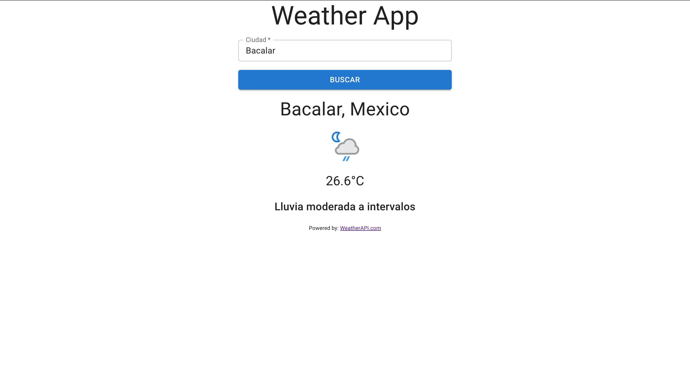

### App Clima

## Tabla de contenido
* Acerca de
* Features
* Stack
* Como funciona
* Empezar
* Atribuciones
* Author

## A cerca de
App clima es una plataforma web que siver para obtener el status del clima de cualquier ciudad en tiempo real

## Features
- Ingresa nombre de ciudad
- Ver resultado del clima

## Stack
- React
- Vite

## Como funciona
App clima funciona mediante el consumo de una API que nos devuelve el resultado del clima del lugar ingresado

## Empezar
Para iniciar el proyecto primero debes:

1. Descargar el repositorio
    - git clone $url-del-repositorio
2. Iniciar el proyecto 
    - npm run dev

## Atribuciones
App clima funciona gracias [Wheater API](https://www.weatherapi.com/)

## Author
- Angela Janeth Cruz Mendoza

